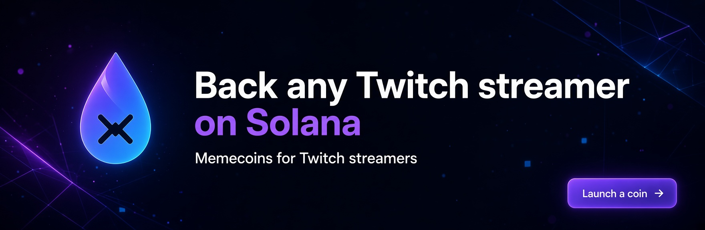

# 💧 XDrop – Memecoins for Twitch Streamers on Solana

**Back any Twitch streamer on Solana.**

XDrop enables anyone to launch a dedicated memecoin for their favorite Twitch streamer – instantly, permissionlessly and fully on-chain on Solana.  
When you launch a coin, you activate the streamer’s entire community – fans and followers can join and support right away.

## ✨ What is XDrop?

XDrop is a decentralized platform that lets the community create and trade memecoins tied to Twitch streamers.  

Support your favorite creators, speculate on their growth, or launch your own streamer coin in seconds – and bring the whole fanbase along for the ride.

- Launch a coin for **any** Twitch streamer
- Activate the streamer’s **followers & community**
- Fully on-chain on **Solana**
- Instant liquidity & trading
- Community-driven backing

## 🚀 Features

- **One-Click Coin Launch** – Create a memecoin linked to any Twitch streamer
- **Community Activation** – Fans and followers can directly join and support their favorite streamer
- **Streamer Backing** – The entire Twitch community becomes part of the token
- **Solana Native** – Ultra-fast & low-fee transactions
- **Beautiful UI** – Clean, dark-themed interface with neon aesthetics
- **Permissionless** – No approval needed. Anyone can launch

## 🖼️ Branding

The iconic glowing droplet with the **X** represents the fusion of liquid markets and the X (Twitter/Crypto) culture – the perfect symbol for streamer memecoins.

## 🛠️ Tech Stack

- **Blockchain**: Solana
- **Frontend**: Next.js + Tailwind
- **Smart Contracts**: Anchor / Solana Program Library
- **Wallet**: Phantom, Solflare, Backpack etc.

## 📦 Getting Started

comming soon
